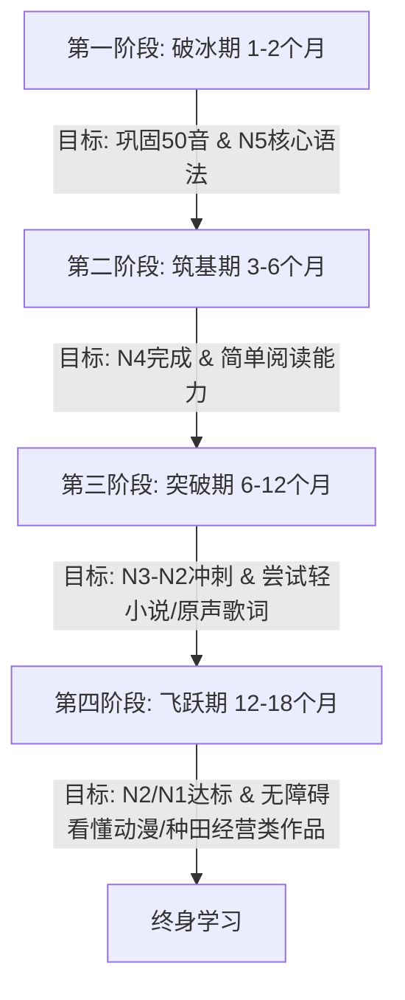

# 日语学习规划白皮书 — 高度定制化系统方案
# 日本語学習カスタマイズ計画书

---

## 一、 阶段目标与学习路线图 (段階目標と学習ロードマップ)

根据您当前的日语基础（已掌握50音但不熟练，有200天多邻国基础，无系统语法概念，对动漫常用语熟悉）以及长期目标（N2/N1），我们将整个学习周期划分为四个阶段：

### 1. 第一阶段：破冰期 (1-2个月) — 50音高效熟练与N5语法入门
*   **核心目标**：
    *   彻底解决50音“看字读音”、“听音辨字”的反应迟钝问题，反应速度达到 0.5 秒以内。
    *   系统化梳理 N5 阶段核心语法（重点：**基本名词/形容词/动词句式，格助词 は、が、を、に、で、と 的核心用法**）。
    *   熟练掌握 PC 端日语罗马字键盘输入。
*   **兴趣切入**：通过动漫最常用的短语（如：*いってきます*、*お帰り*、*お疲れ様*）来练习打字与语法拆解。

### 2. 第二阶段：筑基期 (3-6个月) — N4系统化语法与日常词汇积累
*   **核心目标**：
    *   掌握 N4 级别语法（核心：**动词变形体系** — 连用形、终止形、连体形、意向形、被动形、使役形、授受关系）。
    *   词汇量达到 1500+，重点突破异世界题材（如：*魔法、ギルド/公会、魔王*）和运动题材（如：*ストライカー/前锋、守備/防守*）的常用基础词汇。
*   **兴趣切入**：开始尝试阅读带有振假名（振る仮名，假名标注）的日常/悠闲种田类漫画。

### 3. 第三阶段：突破期 (6-12个月) — N3至N2进阶与兴趣材料精读
*   **核心目标**：
    *   攻克 N3-N2 级别的大量句型。
    *   词汇量扩充至 6000+。
    *   脱离碎片式多邻国，进入以“精读”+“泛听”为主的沉浸式学习模式。
*   **兴趣切入**：精读日摇（J-Rock）歌词，通过歌词学习复杂的隐喻和敬体/简体转换；阅读较简单的异世界轻小说（如《小书痴的下克上》前几章）。

### 4. 第四阶段：飞跃期 (12-18个月) — N2/N1备考与无障碍无字幕观看
*   **核心目标**：
    *   攻克 N1 语法与阅读长难句。
    *   掌握 10000+ 词汇。
    *   通过 JLPT N2/N1 考试，具备无字幕看懂日常番、轻小说及体育新闻的能力。
*   **兴趣切入**：无字幕生肉动漫、体育/异世界经营类游戏（如《足球经理》日语版、种田经营类游戏）。

---

## 二、 核心学习模块详解 (学習コアモジュールの詳細)

### 1. 语法系统专项 (英文法・日本語文法の体系化学习) — ★★★★★ [重中之重]
因为您之前没有系统学过语法，这是您最需要攻克的高墙。我们采用 **“理解概念 -> 句型解构 -> 例句造句”** 的三步走策略。

*   **步骤一：语法框架建立**
    *   日语是**黏着语**，语序为 SOV（主-宾-谓）。句子骨架靠“助词”粘合。
    *   必须先掌握“体言（名、代）”与“用言（动、形、形动）”的概念。
*   **步骤二：动漫/小说例句解构**
    *   不要死记硬背枯燥的例句。利用您熟悉的动漫语感来套语法。
    *   例如：在异世界动漫中常出现的：
        *   例句：*俺はスローライフを送りたい。* (我想过慢生活。)
        *   语法拆解：
            *   *俺 (おれ)*：第一人称代词（我，男性自称）。
            *   *は*：提示助词，提示整个句子的主题。
            *   *スローライフ (Slow life)*：外来语（慢生活），作宾语。
            *   *を*：宾格助词，连接宾语与动词。
            *   *送りたい (おくりたい)*：动词 *送る* (度过/过) 的 **たい形** (表示想要做某事)。

### 2. 50音图高频唤醒 (五十音図の定着化) — ★★★★☆
*   **方法**：利用**罗马字打字练习**来强制大脑建立“读音 -> 假名 -> 键位”的映射。
*   **标准**：看到平假名「あ」在 0.2 秒内大脑反应出它的读音，并能用键盘敲出 `a`。看到片假名「ア」同样能够瞬间识别。

### 3. 词汇的兴趣分类记忆 (興味に沿った単語学習) — ★★★★☆
传统红宝书背诵效率低下，我们采用**主题词汇卡片（Flashcards）**分主题记忆：

| 主题类别 (カテゴリ) | 示例日语词汇 (単語例) | 读音 (読み方) | 中文释义 (意味) |
|---|---|---|---|
| **异世界・种田** | 農業 / 魔法 / 開墾 / ギルド | のうぎょう / まほう / かいこん | 农业 / 魔法 / 开垦 / 公会 |
| **体育・竞技** | ストライカー / 甲子園 / 监督 | すとらいかー / こうしえん / かんとく | 前锋 / 甲子园 / 教练 |
| **日摇・音乐** | 旋律 / ライブハウス / 歌詞 | せんりつ / らいぶ化 / かし | 旋律 / LiveHouse / 歌词 |

---

## 三、 时间管理与模式切换 (時間管理と学習モードの切り替え)

为了适应您灵活的日程，设计了以下两种学习模式，您可以自由切换：

### 1. 碎片打卡模式 (通勤/零碎时间，10-30分钟/天)
适合平时工作学习较忙的日子，目标是保持语感不中断。
*   **10分钟方案**：在 Web 学习应用的「单语帐」中复习 20 个兴趣词汇卡片。
*   **20分钟方案**：在「输入练习」中敲击 20 个动漫短句，同时巩固假名与输入法。
*   **30分钟方案**：在「语法工房」中学习 1 个 N5/N4 语法点，并阅读其对应的 3 个动漫例句。

### 2. 深度强化模式 (周末/空闲时间，2-4小时连续学习)
适合有整块空闲时间时进行爆发式提升。
*   **第 1 小时：语法攻坚**
    *   系统学习 3-4 个有关联的语法点（例如：表示原因的 `から`、`ので`、`ため` 的对比）。
    *   在纸上或电脑中用这几个语法点各造句 3 个。
*   **第 2 小时：兴趣素材精读 (Manga/Anime/Lyrics)**
    *   选择一首喜欢的日摇歌曲（如 ONE OK ROCK, RADWIMPS 等）或一话《蓝色监狱》漫画。
    *   查出歌词或台词中所有不懂的单词，分析其中的动词变形。
*   **第 3 小时：键入与口语同步练习**
    *   在 Web 系统的「打字练习」中输入精读过的歌词或台词，边打字边大声跟读，形成肌肉记忆。
*   **最后 30 分钟：归纳与复盘**
    *   将今天新学到的语法和生词整理到 Web 应用的 localStorage 数据库中，供日常碎片化复习。

---

## 四、 外部学习资源导航 (外部学習リソースナビゲーション)

为了避免依赖单一纸质书，以下为您整理了最优质且免费的在线日语学习资源：

### 1. 语法与词典工具 (辞書・文法ツール)
*   **HJ Dict (沪江小D)**: [https://dict.hjenglish.com/jp/](https://dict.hjenglish.com/jp/)
    *   *用途*：中日/日中快速词汇查询，提供详细例句 and 发音。
*   **OJAD (在线日语声调辞典)**: [http://www.gavo.t.u-tokyo.ac.jp/ojad/](http://www.gavo.t.u-tokyo.ac.jp/ojad/)
    *   *用途*：查询动词变形的声调变化，对于改善动漫语感非常有帮助。
*   **Grammar Library (日本語の文法)**: [https://www.nihongoresources.com/](https://www.nihongoresources.com/)
    *   *用途*：系统性梳理日语语法的英文/中文线上参考站。

### 2. 兴趣阅读素材 (読解・興味教材)
*   **ComicWalker (角川免费漫画网)**: [https://comic-walker.com/](https://comic-walker.com/)
    *   *用途*：日本官方的正版免费漫画网站，包含大量异世界、种田、运动题材漫画，可以直接看最新话。
*   **小説家になろう (成为小说家吧)**: [https://syosetu.com/](https://syosetu.com/)
    *   *用途*：绝大多数异世界轻小说的发源地，全站免费。适合中后期（N3+）进行网页端精读，配合浏览器划词翻译插件效果极佳。
*   **Uta-Net (日本歌词网)**: [https://www.uta-net.com/](https://www.uta-net.com/)
    *   *用途*：最全的日文歌词站，可复制歌词进行语法拆解。

### 3. 日语打字练习 (タイピング練習)
*   **Sushi-da (寿司打)**: [http://neutral.x0.com/home/sushida/play.html](http://neutral.x0.com/home/sushida/play.html)
    *   *用途*：日本最著名的 Flash/HTML5 罗马字打字游戏，寓教于乐，适合用来测试自己的打字速度。
